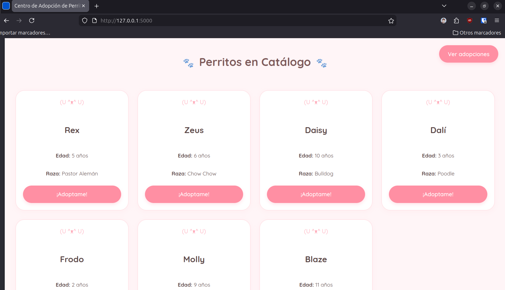
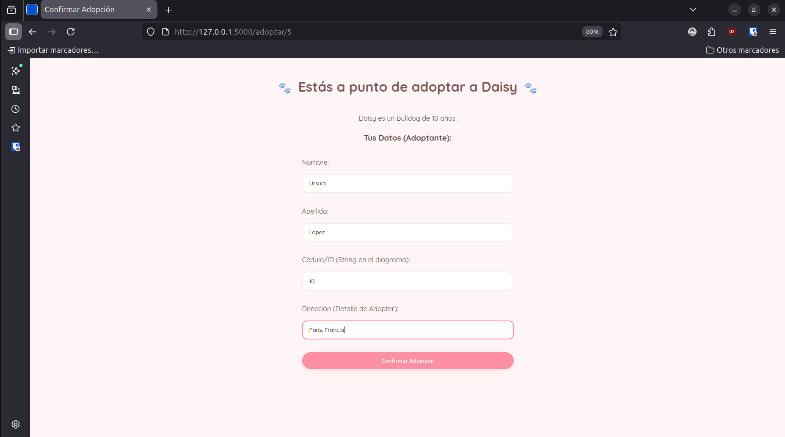
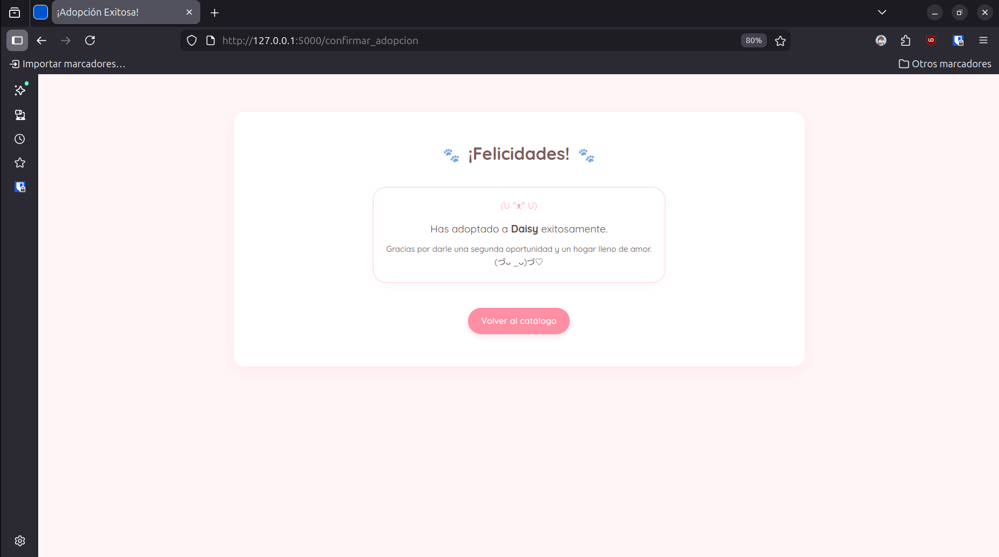
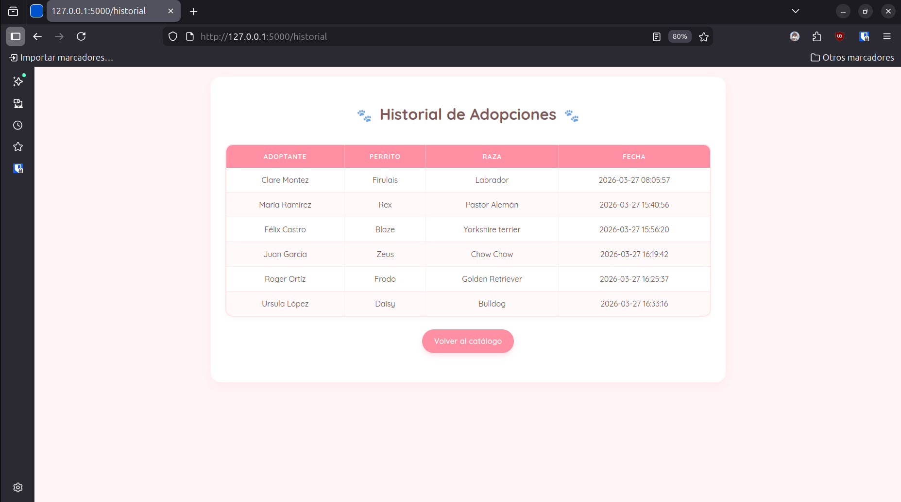

# Sistema de adopción de perritos

##Tabla de contenidos:
-Descripción
-Características
-Capturas de pantalla
-Tecnologías
-Uso

##Descripción
El proyecto permite al usuario a través de una página web adoptar a perritos de una manera rápida, fácil y segura, es útil para darle un hogar digno a estás mascotas ya que antes de adoptar se le pide al usuario llenar un formulario para verificar si es apto para adoptar, el proyecto va dirigido principalmente a los amantes de los perritos.

#Características
-Tiene una interfaz atractiva y amigable para el usuario (colores suaves de tonos rosados)
-Utiliza un servidor en la nube para que los datos se registren en la base de datos
-Posee un historial de las adopciones realizadas
-Un catálogo de perritos que se actualiza cada vez que se adopta uno, para que la información sea verídica

#Capturas de pantalla

#Tecnologías
-**Frontend:** Flask
-**Backend:** Visual Studio Code, MySQL, Html, Css, Python 3

#Uso

##Acceso a la página web
1. Abre el proyecto en Visual Studio Code
2. Ejecuta en la terminal "python routes.py"
3. Accede a la URL que se muestra
   
##Flujo principal de adopción
1. **Explora el catálogo**
  Navega por los perritos disponibles
   
2.**Selecciona un perrito**
  Selecciona "¡Adoptame!" en la tarjeta del perrito que te interese

3.**Completa el formulario**
  Revisa los datos y haz clic en "Confirmar Adopción"

4.**Recibe la confirmación**
 Verás un mensaje de éxito si todos los datos están correctos.

##Visualizar el historial
- En la página del catálogo haz clic en "Ver adopciones", para ver las adopciones realizadas.
